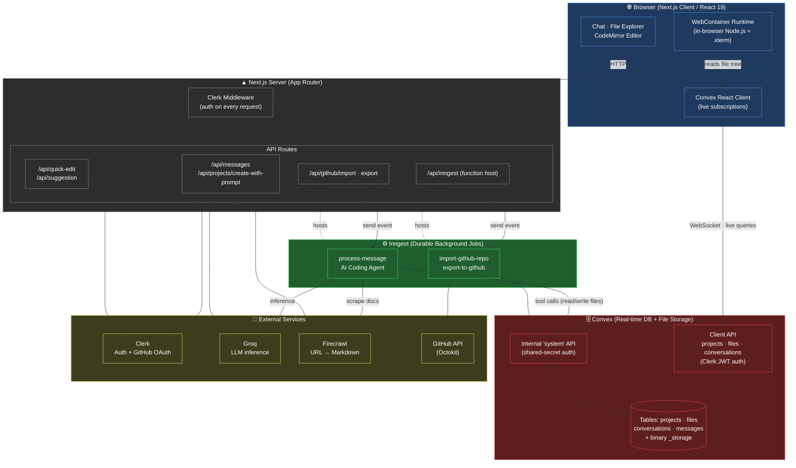
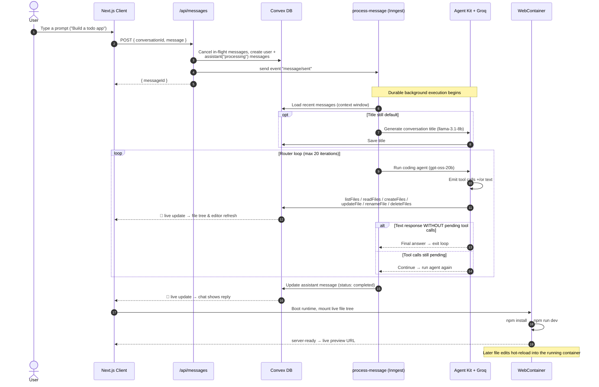
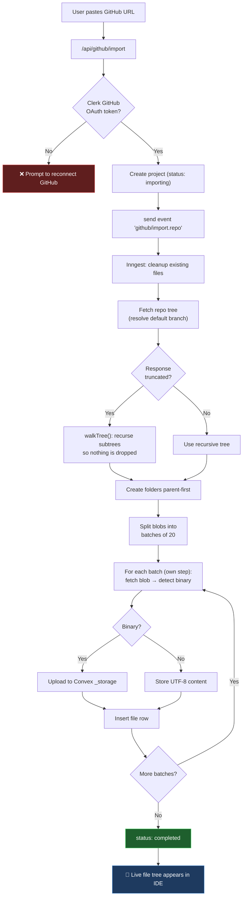

<div align="center">

# ☁️ CloudAIIDE

### Prompt-to-app in your browser — an AI cloud IDE that writes, runs, and ships code.

Describe what you want to build. An AI agent scaffolds the files, a full Node.js
runtime boots **inside your browser tab**, and you get a live preview in seconds —
no local setup, no containers to manage, no deploy step to see it run.

<br />


</div>

---

## 📖 Overview

**CloudAIIDE** is a full-featured, AI-native development environment that runs
entirely in the browser. It closes the gap between *"I have an idea"* and
*"it's running"* by combining three things most tools keep separate:

1. **An autonomous coding agent** that turns a natural-language prompt into a
   real, multi-file project.
2. **A real-time backend** (Convex) that stores every project as a live file
   tree and streams changes to every connected client instantly.
3. **A browser-native runtime** (WebContainers) that installs dependencies and
   runs your dev server *client-side* — so the preview you see is your code
   actually executing, not a screenshot.

### The problem it solves

Traditional "AI app builders" either hand you a code dump you still have to run
yourself, or lock you into an opaque hosted sandbox you can't inspect. Local
development, meanwhile, means installing runtimes, wiring up toolchains, and
fighting "works on my machine" before you write a single line.

CloudAIIDE removes all of that friction:

| Pain point | CloudAIIDE's answer |
| :--- | :--- |
| "Set up my environment first." | The runtime **is** the browser tab — nothing to install. |
| "The AI gave me code I can't run." | The agent writes into a live workspace that boots instantly. |
| "I can't see my changes." | Edits stream to a hot-reloading preview in real time. |
| "How do I get this into version control?" | One-click **GitHub import / export** via OAuth. |
| "I want to tweak the generated code." | A full **CodeMirror** editor with AI autocomplete & inline edits. |

### Key features

- 🧠 **Prompt-to-app agent** — a durable, tool-using AI agent that lists, reads,
  creates, updates, renames, and deletes files to fulfill your request.
- ⚡ **Live in-browser preview** — WebContainers boot a Node.js runtime, run
  `npm install` + your dev command, and serve the app in an iframe.
- ✍️ **AI-assisted editing** — inline autocomplete (ghost text) and
  selection-based "quick edit" powered by Groq, with optional URL context
  scraping via Firecrawl.
- 🔄 **Real-time everything** — Convex subscriptions keep the file explorer,
  editor, chat, and preview in sync across sessions with zero polling.
- 🐙 **GitHub sync** — import any repo as a project or export your project to a
  new GitHub repository.
- 🔐 **Auth built in** — Clerk handles sign-in and issues the GitHub OAuth token
  used for repo access.

---

## 🏛️ System Architecture

CloudAIIDE is a **Next.js application** split into a real-time client, a set of
server-side API routes, a **Convex** real-time database, and a durable
background-job layer (**Inngest**) where the AI agent and long-running GitHub
syncs execute.



### How the pieces fit together

- **Two doors into Convex.** The **Client API** (`convex/projects.ts`,
  `files.ts`, `conversations.ts`) is called directly from React and authorizes
  every call against the Clerk JWT (`verifyAuth`). The **internal `system` API**
  (`convex/system.ts`) is called only from trusted server code (API routes and
  Inngest jobs) and is guarded by a shared secret
  (`CLOUDAIIDE_CONVEX_INTERNAL_KEY`) — this is how the AI agent mutates files on
  behalf of a user without a browser session.
- **Convex is the source of truth.** Files live as a tree (`parentId` links
  children to parents; text lives in `content`, binaries in Convex `_storage`).
  Because the client subscribes to live queries, an agent writing a file on the
  server appears in the editor and preview **without a refresh**.
- **Long work is durable.** The AI agent and GitHub syncs run as Inngest
  functions with automatic retries, step checkpointing, and cancellation — a
  dropped connection or a slow model never leaves the workspace half-built.

---

## 🔀 Core Workflows

### Workflow 1 — Prompt → running app (the agent loop)

This is the flagship path: a user's prompt is turned into a live application by
an agent that iteratively calls file tools until it has a complete answer.



**Why the router loop matters:** the agent can emit text *and* tool calls in the
same turn. The network router (`process-message.ts`) only stops when it sees a
text response **with no accompanying tool calls** — otherwise it keeps looping
(up to `maxIter: 20`), letting the agent read a file, act on it, and explain
itself in a natural back-and-forth.

### Workflow 2 — GitHub import (durable, batched, fault-tolerant)

Importing a repo can mean thousands of files. This flow shows how the job stays
resilient by checkpointing work into bounded Inngest steps.



Each batch is its own Inngest step, so a transient failure only retries that
batch — a large or deep repository never restarts the entire import from scratch.

---

## 🧰 Tech Stack

| Category | Technologies |
| :--- | :--- |
| **Language** | TypeScript 5 |
| **Framework** | Next.js 16 (App Router), React 19 |
| **Real-time backend** | [Convex](https://convex.dev) (reactive DB + file storage) |
| **Authentication** | [Clerk](https://clerk.com) (+ GitHub OAuth for repo access) |
| **Background jobs** | [Inngest](https://inngest.com) (durable, retryable functions) |
| **AI orchestration** | [Inngest Agent Kit](https://agentkit.inngest.com), [Vercel AI SDK](https://sdk.vercel.ai) |
| **LLM provider** | [Groq](https://groq.com) — `openai/gpt-oss-20b` (agent), `llama-3.3-70b-versatile` (quick edit), `llama-3.1-8b-instant` (autocomplete & titles) |
| **In-browser runtime** | [WebContainers](https://webcontainers.io) (`@webcontainer/api`) + [xterm.js](https://xtermjs.org) |
| **Code editor** | [CodeMirror 6](https://codemirror.dev) (JS/TS, HTML, CSS, JSON, Python, Markdown, minimap, one-dark theme) |
| **Web scraping** | [Firecrawl](https://firecrawl.dev) (URL → Markdown for doc context) |
| **GitHub API** | [Octokit](https://github.com/octokit/octokit.js) |
| **UI & styling** | Tailwind CSS 4, Radix UI primitives, shadcn-style components, `lucide-react`, `motion`, `next-themes` |
| **Layout** | Allotment, `react-resizable-panels` (split panes) |
| **Client state** | Zustand (editor store), TanStack React Form, React Hook Form |
| **Validation & HTTP** | Zod 4, `ky` |
| **Tooling** | ESLint 9, `eslint-config-next`, PostCSS |

> ℹ️ The `@ai-sdk/anthropic` and `@ai-sdk/google` provider packages are installed
> and available for extending the agent to additional LLM providers; the active
> inference paths currently target Groq.

---

## 📂 Directory Structure

```
CloudAIIDE/
├── convex/                          # Convex real-time backend (schema + functions)
│   ├── schema.ts                    # Tables: projects, files, conversations, messages
│   ├── auth.ts                      # verifyAuth() — Clerk-JWT identity guard
│   ├── auth.config.ts               # Convex ↔ Clerk JWT provider config
│   ├── projects.ts                  # Client API: project CRUD + settings (auth'd)
│   ├── files.ts                     # Client API: file tree CRUD, paths, folders (auth'd)
│   ├── conversations.ts             # Client API: conversations & message reads (auth'd)
│   └── system.ts                    # Internal API: shared-secret mutations for server/agent
│
├── src/
│   ├── app/                         # Next.js App Router
│   │   ├── layout.tsx               # Root layout (fonts, providers, toaster)
│   │   ├── page.tsx                 # Projects dashboard (home)
│   │   ├── projects/[projectId]/    # The IDE workspace route
│   │   └── api/                     # Server-side route handlers
│   │       ├── messages/            # Send / cancel chat messages → triggers agent
│   │       ├── projects/            # create-with-prompt (new project from a prompt)
│   │       ├── quick-edit/          # AI selection-based code edit
│   │       ├── suggestion/          # AI inline autocomplete
│   │       ├── github/              # import / export / reset / cancel
│   │       └── inngest/             # Inngest function host endpoint
│   │
│   ├── features/                    # Feature-sliced modules (UI + hooks + logic)
│   │   ├── auth/                    # Signed-out / loading views
│   │   ├── conversations/           # Chat UI + the AI agent & its file tools
│   │   │   └── inngest/
│   │   │       ├── process-message.ts   # ⭐ The coding agent + router loop
│   │   │       ├── constants.ts         # System prompts
│   │   │       └── tools/               # createFiles, readFiles, updateFile, ...
│   │   ├── editor/                  # CodeMirror editor, extensions, quick-edit/suggestion
│   │   ├── preview/                 # WebContainer hook, terminal, file-tree builder
│   │   └── projects/               # Dashboard, file explorer, GitHub import/export
│   │       └── inngest/            # import-github-repo.ts, export-to-github.ts
│   │
│   ├── components/
│   │   ├── ai-elements/             # AI chat primitives (message, reasoning, tool, ...)
│   │   ├── ui/                      # shadcn-style Radix components
│   │   └── providers.tsx            # Clerk + Convex + Theme provider tree
│   │
│   ├── inngest/                     # Inngest client + shared functions
│   ├── lib/                         # convex-client, groq, firecrawl, utils
│   └── proxy.ts                     # Clerk middleware matcher
│
├── public/                          # Static assets
├── next.config.ts                   # COOP/COEP headers (required for WebContainers)
├── .env.example                     # Environment variable template
└── package.json
```

---

## 🚀 Getting Started

### Prerequisites

- **Node.js 20+** and npm
- Free accounts on the services CloudAIIDE orchestrates:
  - [Convex](https://convex.dev) — real-time database
  - [Clerk](https://clerk.com) — authentication (enable the **GitHub** social connection for import/export)
  - [Groq](https://console.groq.com/keys) — LLM inference
  - [Inngest](https://app.inngest.com) — background jobs
  - [Firecrawl](https://firecrawl.dev) — URL scraping

> ⚠️ **Browser requirement:** the live preview relies on WebContainers, which
> need a Chromium-based browser and cross-origin isolation. The required
> `Cross-Origin-Opener-Policy` / `Cross-Origin-Embedder-Policy` headers are
> already set in [`next.config.ts`](next.config.ts).

### 1. Clone & install

```bash
git clone https://github.com/utkarshpawade/CloudAIIDE.git
cd CloudAIIDE
npm install
```

### 2. Configure environment variables

Copy the template and fill in your values:

```bash
cp .env.example .env.local
```

```dotenv
# ── Convex ──────────────────────────────────────────────────────────
# Provided automatically when you run `npx convex dev`.
NEXT_PUBLIC_CONVEX_URL=

# Shared secret between the Next.js server and Convex's internal actions.
# Generate one with:  openssl rand -hex 32
# Set the SAME value in your Convex deployment's environment variables.
CLOUDAIIDE_CONVEX_INTERNAL_KEY=

# ── Clerk (https://dashboard.clerk.com) ─────────────────────────────
NEXT_PUBLIC_CLERK_PUBLISHABLE_KEY=
CLERK_SECRET_KEY=
# The Clerk JWT issuer domain — also set this in Convex's env vars.
CLERK_JWT_ISSUER_DOMAIN=

# ── AI provider: Groq (https://console.groq.com/keys) ───────────────
GROQ_API_KEY=

# ── Inngest (https://app.inngest.com) ───────────────────────────────
INNGEST_EVENT_KEY=
INNGEST_SIGNING_KEY=

# ── Firecrawl (https://firecrawl.dev) ───────────────────────────────
FIRECRAWL_API_KEY=
```

> 🔑 **Two places, one key.** `CLOUDAIIDE_CONVEX_INTERNAL_KEY` and
> `CLERK_JWT_ISSUER_DOMAIN` must be set in **both** your `.env.local` *and* your
> Convex deployment. Configure a
> [Convex + Clerk JWT template](https://docs.convex.dev/auth/clerk) named
> `convex` so `convex/auth.config.ts` resolves your issuer domain.

### 3. Start Convex

In a dedicated terminal, run the Convex dev server. This provisions your
deployment, pushes the schema, and prints your `NEXT_PUBLIC_CONVEX_URL`:

```bash
npx convex dev
```

### 4. Start the Next.js app

In a second terminal:

```bash
npm run dev
```

Visit **[http://localhost:3000](http://localhost:3000)**, sign in with Clerk, and
create your first project from a prompt.

### 5. (For background jobs) Run the Inngest dev server

The AI agent and GitHub syncs execute as Inngest functions served at
`/api/inngest`. To exercise them locally, start the Inngest dev server pointed at
that endpoint:

```bash
npx inngest-cli@latest dev -u http://localhost:3000/api/inngest
```

The Inngest dev dashboard (default `http://localhost:8288`) lets you watch each
agent step, tool call, and retry in real time.

### Available scripts

| Script | Description |
| :--- | :--- |
| `npm run dev` | Start the Next.js dev server |
| `npm run build` | Production build |
| `npm run start` | Serve the production build |
| `npm run lint` | Run ESLint |

---

## 📡 Usage & API

CloudAIIDE exposes two kinds of programmatic surface: **HTTP route handlers**
(called by the client, guarded by Clerk) and **Convex functions** (called over
Convex's reactive protocol). All HTTP routes require an authenticated Clerk
session.

### HTTP API routes

<details open>
<summary><b>Create a project from a prompt</b></summary>

Creates a project + conversation, seeds the first message, and dispatches the
coding agent.

```http
POST /api/projects/create-with-prompt
Content-Type: application/json

{ "prompt": "Build a Pomodoro timer with a dark theme" }
```

```jsonc
// 200 OK
{ "projectId": "j57..." }
```
</details>

<details>
<summary><b>Send a message to the agent</b></summary>

Cancels any in-flight messages for the project, records the user + placeholder
assistant messages, and triggers the `message/sent` Inngest event. The assistant
reply streams into Convex and appears via live subscription.

```http
POST /api/messages
Content-Type: application/json

{ "conversationId": "k82...", "message": "Add a reset button" }
```

```jsonc
// 200 OK
{ "success": true, "eventId": "01J...", "messageId": "m91..." }
```

Cancel in-flight processing with `POST /api/messages/cancel`.
</details>

<details>
<summary><b>AI inline autocomplete</b></summary>

Powers the editor's ghost-text suggestions (`llama-3.1-8b-instant`, tuned for
low latency). Returns an empty suggestion when the surrounding code is already
complete.

```http
POST /api/suggestion
Content-Type: application/json

{
  "fileName": "app.tsx",
  "code": "…full file…",
  "currentLine": "  const [count, setCount] = ",
  "previousLines": "…",
  "textBeforeCursor": "const [count, setCount] = ",
  "textAfterCursor": "",
  "nextLines": "…",
  "lineNumber": 12
}
```

```jsonc
// 200 OK
{ "suggestion": "useState(0);" }
```
</details>

<details>
<summary><b>AI quick edit (selection-based)</b></summary>

Rewrites a selected block per an instruction (`llama-3.3-70b-versatile`). If the
instruction contains URLs, they are scraped via Firecrawl and injected as
documentation context.

```http
POST /api/quick-edit
Content-Type: application/json

{
  "selectedCode": "function add(a, b) { return a + b }",
  "fullCode": "…surrounding file…",
  "instruction": "Add JSDoc and TypeScript types"
}
```

```jsonc
// 200 OK
{ "editedCode": "/** Adds two numbers */\nfunction add(a: number, b: number): number { return a + b }" }
```
</details>

<details>
<summary><b>GitHub import / export</b></summary>

Both use the caller's Clerk-issued GitHub OAuth token and run as durable Inngest
jobs.

```http
POST /api/github/import
{ "url": "https://github.com/owner/repo" }

POST /api/github/export
{ "projectId": "j57...", "repoName": "my-app", "visibility": "private", "description": "..." }
```

Companion routes: `POST /api/github/export/cancel`, `POST /api/github/export/reset`.
</details>

### Convex functions (client-facing)

Called from React via `useQuery` / `useMutation`. Every handler authorizes the
Clerk identity and verifies project ownership.

| Function | Type | Purpose |
| :--- | :--- | :--- |
| `projects.get` / `getPartial` | query | List the current user's projects |
| `projects.getById` | query | Fetch a single owned project |
| `projects.create` / `rename` / `updateSettings` | mutation | Manage projects & run commands |
| `files.getFiles` | query | Full file tree for a project (drives editor + preview) |
| `files.getFolderContents` | query | Immediate children of a folder (sorted) |
| `files.getFilePath` | query | Ancestor chain for breadcrumbs |
| `files.createFile` / `createFolder` / `renameFile` / `updateFile` / `deleteFile` | mutation | File-tree CRUD |
| `conversations.getByProject` / `getMessages` | query | Chat history |
| `conversations.create` | mutation | Start a new conversation |

### The agent's toolbox

Inside the `process-message` job, the coding agent is equipped with these tools
(defined in `src/features/conversations/inngest/tools/`), each writing through
the internal `system` API:

`listFiles` · `readFiles` · `createFiles` · `createFolder` · `updateFile` ·
`renameFile` · `deleteFiles` · `scrapeUrls`

Because these mutations land in Convex, every action the agent takes is streamed
live to the editor, file explorer, and preview.

---

## 🤝 Contributing

Contributions are welcome. Please open an issue to discuss substantial changes
before submitting a pull request, and run `npm run lint` before pushing.

## 📄 License

Released under the **MIT License**.

---

<div align="center">
<sub>Built with Next.js, Convex, Inngest, WebContainers, and Groq — by <a href="https://github.com/utkarshpawade">Utkarsh Pawade</a>.</sub>
</div>
